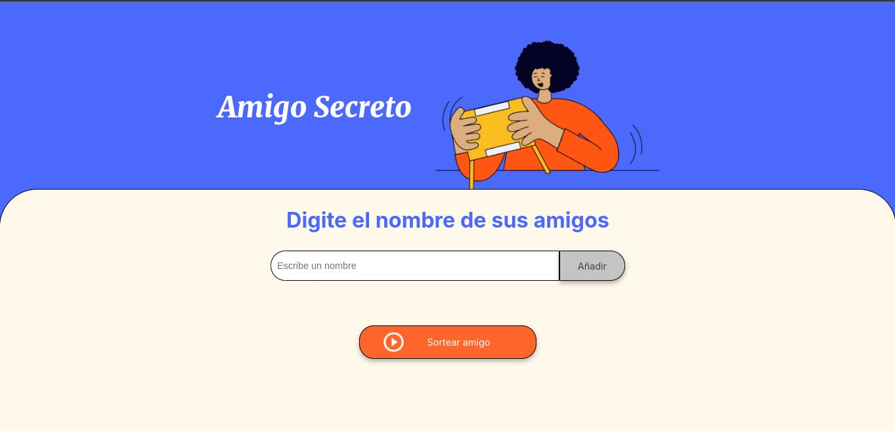

# Amigo Secreto

_Es una aplicación que permite a los usuarios ingresar nombres de amigos en una lista para luego realizar un sorteo aleatorio y determinar quién es el "amigo secreto" y mostrar el resultado en pantalla_

## Comenzando 🚀

_El siguiente link te permitira obtener una copia del proyecto base para propósitos de desarrollo y pruebas._

[Proyecto base](https://github.com/Oracle-Next-Education/challenge-amigo-secreto_esp/archive/refs/heads/main.zip)

## Construido con 🛠️

*  **CSS**
*  **HTML**
*  **JavaScript** 

## Autores ✒️

* **Oracle Next Education** - *Trabajo Inicial* - [angel](https://github.com/Oracle-Next-Education/challenge-amigo-secreto_esp)

* **Romero Angel** - *Trabajo Final* - [angel](https://github.com/angelromero933)

---
⌨️ con ❤️ por [angel](https://github.com/angelromero933) 😊
